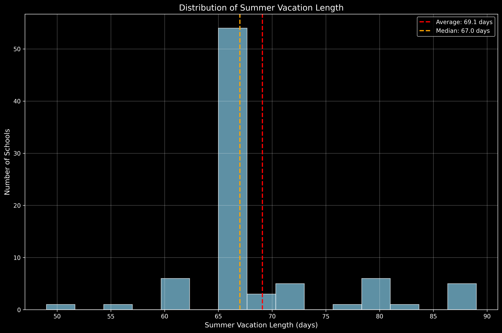
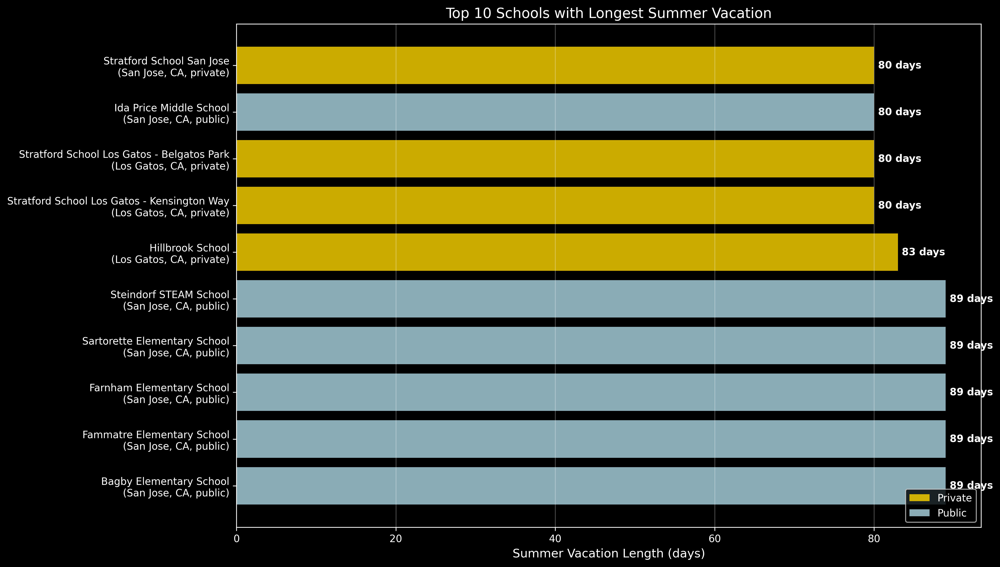
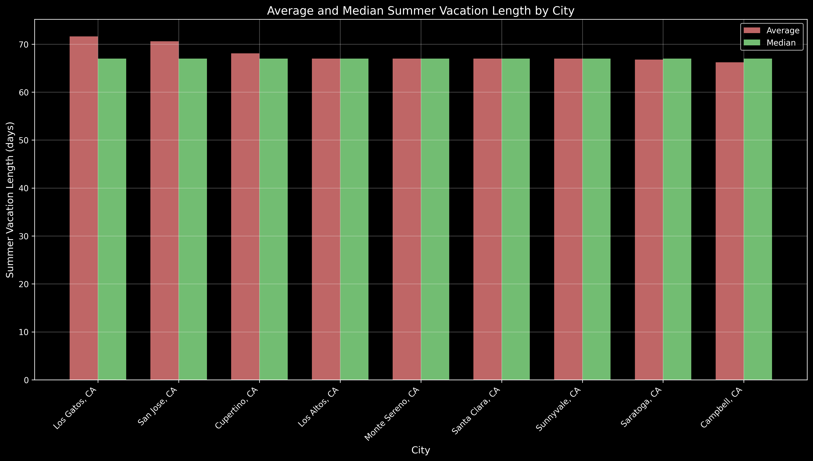
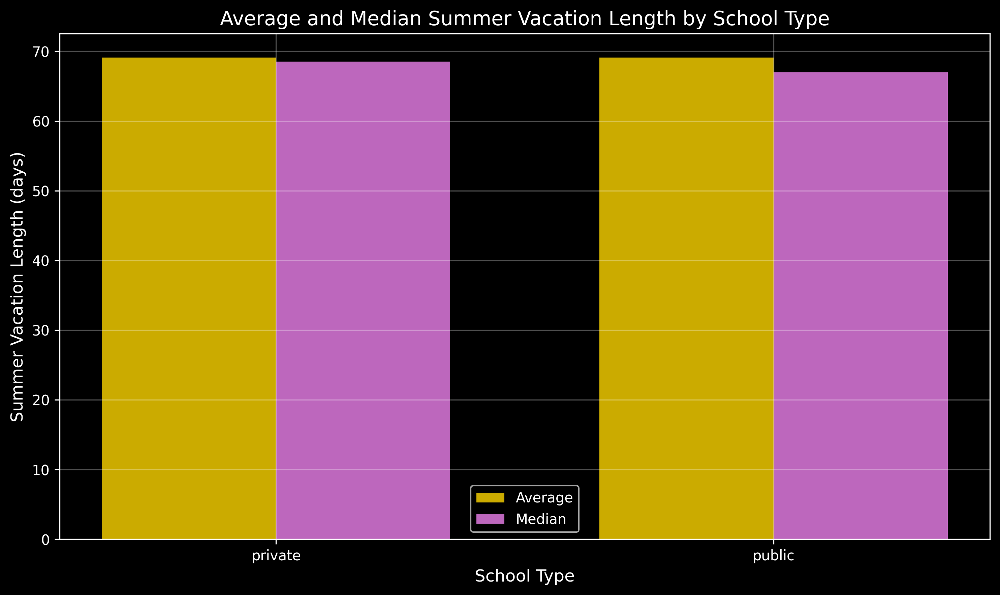

# The Long Summer Gap: How Extended School Breaks Leave Kids Behind

*An analysis of summer vacation lengths across Bay Area schools reveals a concerning trend*

---

**About this analysis**: Data collection was conducted with the help of Google Gemini Deep Research, writing was polished with Claude, and plots were generated with the help of Claude Code.

## The Hidden Cost of Longer Summer Breaks

When we think about summer vacation, we often imagine carefree days of fun and relaxation. But new data from 83 Bay Area schools reveals a troubling reality: some students face nearly three months of unstructured time, while summer activities and programs shut down around them.

## The Numbers Tell a Story

Our analysis of summer vacation lengths across the Bay Area shows significant variation:

- **Average vacation length**: 69.1 days (just over 2 months)
- **Median vacation length**: 67 days 
- **Range**: 49 to 89 days
- **Most common length**: 67 days

But it's the outliers that tell the most concerning story.


*Figure 1: Distribution of summer vacation lengths across 83 Bay Area schools. The histogram shows most schools cluster around 67 days, with notable outliers at 89 days.*

## The 89-Day Challenge

Five schools in our dataset assign summer vacations lasting a staggering **89 days** - nearly three full months. These schools, all public institutions in San Jose, include:

1. Bagby Elementary School
2. Fammatre Elementary School  
3. Farnham Elementary School
4. Sartorette Elementary School
5. Steindorf STEAM School

To put this in perspective, that's 22 more days than the shortest vacation in our dataset - almost a full month of additional break time.


*Figure 2: The top 10 schools with the longest summer vacations. Five San Jose public schools tie for the longest at 89 days, followed by several private schools.*

## When Summer Programs End, What's Left?

Here's where the problem becomes acute. Most summer programs operate on a schedule that assumes a "typical" summer break:

- **Summer camps** typically run 6-8 weeks (42-56 days)
- **Amusement parks** often reduce hours or close sections after Labor Day
- **Community centers** scale back youth programming in late August
- **Libraries** wind down summer reading programs by mid-August
- **Sports leagues** and lessons often end by early August

For students at schools with 89-day vacations, this creates a **3-4 week gap** at the end of summer where organized activities disappear but school hasn't resumed.

## The Geographic Divide

Our city-by-city analysis reveals interesting patterns:

```
City              Average Vacation    Median
                     (days)           (days)
-------------------------------------------------
Los Gatos            71.6             67.0
San Jose             70.6             67.0  
Cupertino            68.1             67.0
Saratoga             66.8             67.0
Campbell             66.2             67.0
```

Los Gatos leads with the longest average vacation, while Campbell has the shortest. This geographic clustering suggests district-level policies may be driving these differences.


*Figure 3: Average and median summer vacation lengths by city. Los Gatos shows the highest average at 71.6 days, while Campbell has the shortest at 66.2 days.*

## Public vs Private: A Surprising Tie

Contrary to expectations, our data shows:

- **Private schools**: 69.1 days average
- **Public schools**: 69.1 days average

However, private schools showed more variation (median of 68.5 vs 67.0 days), suggesting they have more flexibility in setting their calendars.


*Figure 4: Comparison of summer vacation lengths between public and private schools. Despite having the same average length (69.1 days), private schools show slightly more variation.*

## The Activity Desert

Students facing the longest summer breaks encounter what we might call an "activity desert" in late August and early September:

### What Closes Down:
- Most day camps end by mid-August
- Swimming lessons conclude by Labor Day weekend
- Youth sports leagues finish seasons in early August
- Many museums reduce children's programming
- Amusement parks switch to weekend-only operations

### What Remains:
- Childcare (for working parents who can afford it)
- Informal neighborhood activities
- Screen time and unstructured play
- Limited library programming

## The Learning Loss Connection

Research has consistently shown that students lose academic ground during summer breaks - a phenomenon known as "summer learning loss" or the "summer slide." For students facing 89-day vacations, this effect is likely amplified.

The lack of structured activities in those final weeks compounds the problem. Without camps, programs, or school to provide routine and learning opportunities, students may experience:

- Increased screen time
- Social isolation
- Loss of structured learning
- Regression in academic skills
- Difficulty readjusting to school routines

## Recommendations for Change

Based on this analysis, several stakeholders could take action:

### For School Districts:
- Consider capping summer vacation lengths at 70-75 days
- Implement year-round schooling with shorter, more frequent breaks
- Partner with community organizations to extend programming

### For Community Organizations:
- Extend summer programming through early September
- Create "transition to school" programs for late August
- Coordinate with local school calendars when planning activities

### For Parents:
- Advocate for reasonable summer vacation lengths
- Form community groups to organize end-of-summer activities
- Push for district transparency about calendar decisions

## The Bottom Line

While summer vacation serves important purposes - rest, family time, and different types of learning - the data suggests some schools may be pushing these breaks beyond their optimal length. When vacation extends well beyond the infrastructure of summer activities, students suffer.

The five schools with 89-day vacations might want to reconsider: are they truly serving their students' best interests, or are they inadvertently creating an "activity desert" that leaves kids behind?

---

*This analysis was conducted using data from 83 Bay Area schools. Schools with missing summer vacation data or vacations shorter than 40 days were excluded from the analysis.*

## Data Sources and Methodology

- **Dataset**: Summer vacation lengths for 165 Bay Area schools
- **Cleaned dataset**: 83 schools (removed incomplete data and vacations <40 days)
- **Analysis period**: 2025 summer vacation schedules
- **Geographic scope**: San Jose, Los Gatos, Cupertino, Saratoga, Campbell, and surrounding areas

For detailed statistics and visualizations, see the accompanying analysis files.