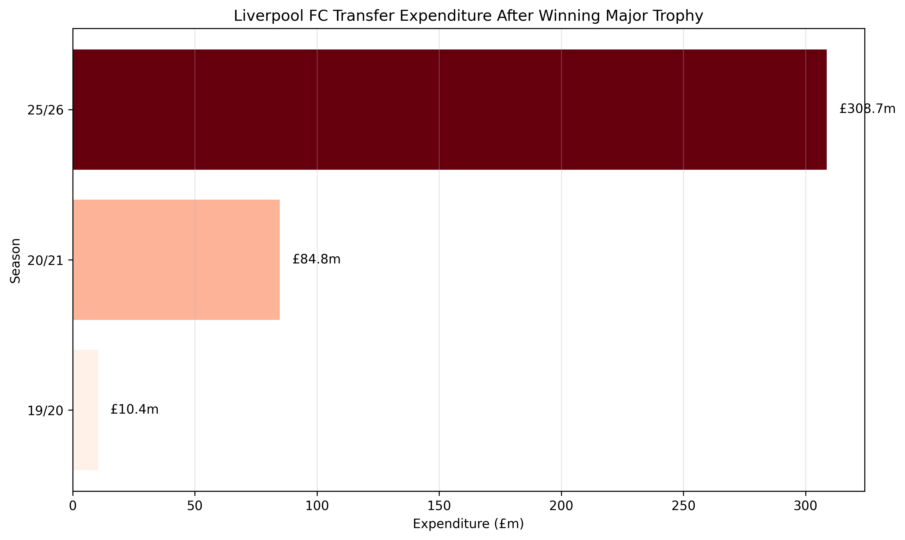
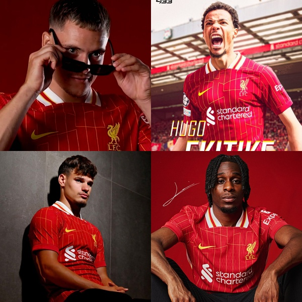
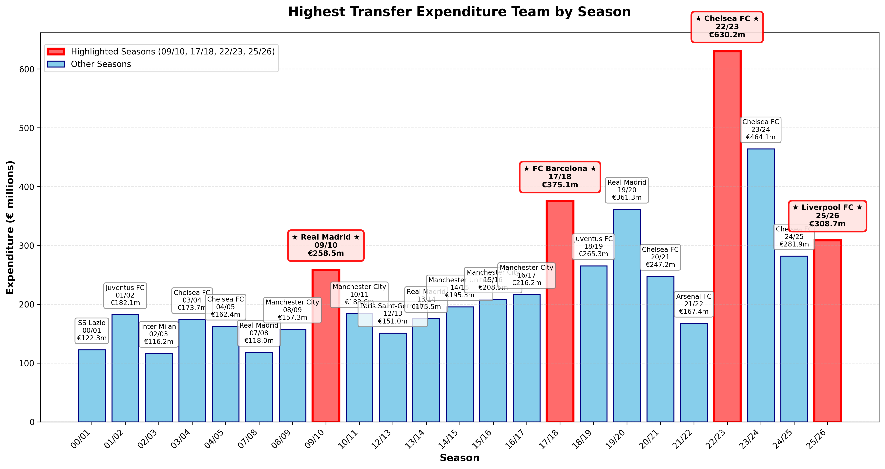
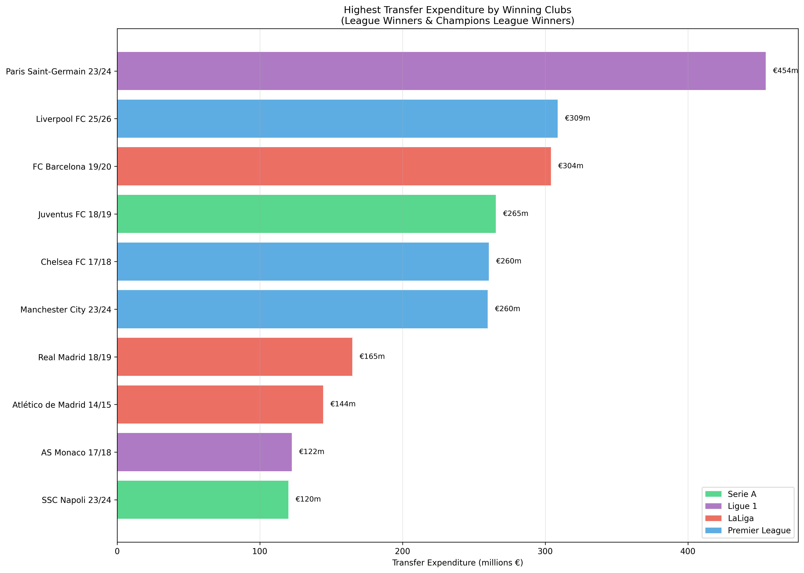

# Liverpool FC 25/26: The Most Legendary Reinforcement in Football History

## The Revolution Finally Arrives at Anfield

For years, Liverpool fans watched in frustration as their club celebrated major triumphs only to see minimal reinforcement. The data tells a sobering story:

After winning the Premier League in 2019/20, they spent a mere £10.4m. Following their Champions League victory in 2020/21, just £84.8m. **But 2025/26 changed everything.**

With £308.7m invested after winning the 2024/25 Premier League title, Liverpool finally broke their conservative post-victory pattern. But the question remains: **Is this the most legendary reinforcement by a winning team in football history?**

## The New Faces of Anfield

The quartet that changed everything:
- **Florian Wirtz (€125m)**: Germany's generational attacking midfielder
- **Hugo Ekitiké (€95m)**: France's most promising striker  
- **Milos Kerkez (€46.9m)**: Hungary's dynamic left-back
- **Jeremie Frimpong (€40m)**: Netherlands' pace merchant

## Defining "Legendary": More Than Just Money

While raw spending numbers are impressive, they don't tell the full story:

Chelsea's £630.2m spending in 22/23 dwarfs Liverpool's investment, and Barcelona's €375.1m in 17/18 after losing Neymar was equally massive. Even Real Madrid's iconic 09/10 window "only" cost €258.5m. But raw expenditure doesn't equal legendary status.

True legendary reinforcement requires:
- **Strategic timing** after major success
- **Quality over quantity** in signings
- **Long-term impact** potential
- **Perfect squad complementarity**

This is why we must compare Liverpool only to other **champions** who reinforced after winning domestic leagues or Champions League titles.

## The Champions-Only Analysis

When we filter for only teams that won major trophies the previous season, a clearer picture emerges. The top contenders for "most legendary reinforcement" become:

1. **Paris Saint-Germain 23/24** - €454m
2. **Liverpool FC 25/26** - €309m  
3. **FC Barcelona 19/20** - €304m
4. **Juventus FC 18/19** - €265m
5. **Chelsea FC 17/18** - €260m
6. **Manchester City 23/24** - €260m
7. **Real Madrid 18/19** - €165m
8. **Atlético Madrid 14/15** - €144m

## The Tournament of Champions: Liverpool's Path to Glory

Right, let's get into the nitty-gritty here. I've watched enough transfer windows to know that it's not just about the money - it's about the thinking behind it, the tactical intelligence, and whether you're solving actual problems or just throwing cash around like confetti. Let me break down each matchup properly:

### First Round: The Foundation Battles

#### (1) PSG 23/24 vs (8) Atlético Madrid 14/15

**PSG 23/24** - The French Revolution Approach
Listen, when you're spending €454m, you better have a plan. Let me tell you what PSG did right and wrong:

*What worked:* Kolo Muani at €95m - this lad can play across the front line, gives them that physical presence they'd been missing since Cavani left. Gonçalo Ramos at €65m - pure goal threat, different profile to Mbappé. Ousmane Dembélé at €50m - bringing him home to France, and at his peak years, this could be genius.

*The tactical intelligence:* Manuel Ugarte at €60m - finally, a proper defensive midfielder who can do the dirty work. Lucas Hernández at €45m - versatility at its finest, can play left-back or center-half. That's the kind of squad depth you need for Champions League success.

*The concerns:* Bradley Barcola at €45m feels steep for potential. But here's the thing - in Ligue 1, even if half these signings work out, they're walking the league.

**Atlético Madrid 14/15** - The Surgeon's Precision
€144m doesn't sound like much now, but remember, this was 2014 money. Every euro was strategic:

*Antoine Griezmann €54m* - I called this one at the time. The lad had that hunger, that intelligence to drop deep and create as well as finish. Perfect for Simeone's system where your forwards need to be complete players.

*Jan Oblak €16m* - Steal of the century, wasn't it? Best goalkeeper of his generation for the price of a squad player. That's the kind of business that wins you leagues.

*Mario Mandžukić €22m* - Pure Atlético signing. Work rate, aerial ability, never stops running. Exactly what you need for Simeone's high-intensity pressing.

**My Verdict:** Look, PSG's ambition is massive, but Atlético's window was perfect execution. Every single signing became integral. In football terms, I'd rather have three perfect signings than ten good ones. But the sheer scale of PSG's investment in today's market? 

**Winner: PSG 23/24** - The ambition wins it, but it was closer than the money suggests.

#### (4) Juventus 18/19 vs (5) Chelsea 17/18

**Juventus 18/19** - The Statement Window
This is what happens when a club says "We're not messing about anymore." €265m for what? To bring Cristiano Ronaldo to Serie A at 33 years old. Mental.

*Cristiano Ronaldo €117m* - Look, the fee was massive, but this changed everything. Not just for Juve, but for Serie A. Suddenly every match matters more, every game is box office. And the man delivered - 21 goals in his first season in a new league at that age? Come on.

*João Cancelo €40.4m* - This was brilliant business. Natural attacking full-back who could bomb forward, perfect for Juventus's 4-3-3. The pace and delivery from wide areas they'd been missing.

*Douglas Costa €40m* - Bit of a gamble this one, but when he was fit, he gave them that direct running they needed. Problem was keeping him fit.

*Leonardo Bonucci €35m* - The homecoming. Knows the system, leadership, can play those long passes from deep. Made perfect sense.

**Chelsea 17/18** - The Conte Conundrum
€260m spent, but was it spent smartly? Antonio needed specific players for his 3-4-3, and the board... well, they tried.

*Álvaro Morata €66m* - The big problem. Looked the part physically, but mentally? Struggled with the pressure. When your main striker signing doesn't work, everything else falls apart.

*Tiémoué Bakayoko €40m* - Monaco player, looked class in France, but the Premier League is different, isn't it? Needed more time than he got.

*Danny Drinkwater €37.9m* - I mean, what were they thinking? Leicester player who worked in that specific system, but at Chelsea? Never fitted.

*Antonio Rüdiger €35m* - Now this was smart business. Proper defender, good in the air, quick enough for a high line. Probably their best signing that window.

**My Verdict:** One window built around a generational player who delivered, the other scattered signings hoping something sticks.

**Winner: Juventus 18/19** - When you get Ronaldo and he delivers a title, everything else is just details.

#### (3) Barcelona 19/20 vs (6) Manchester City 23/24

**Barcelona 19/20** - The Post-Neymar Panic Buy
€304m to replace what they'd lost. But were they thinking clearly?

*Antoine Griezmann €120m* - World Cup winner, proven goalscorer, but did he fit? That's the problem - Griezmann's best position is where Messi played. You're asking him to play wide or deeper, and that's not getting the best out of a €120m player.

*Frenkie de Jong €86m* - Now this was smart. Dutch football intelligence, can play multiple positions, press resistant. Everything you want in a modern midfielder. Best signing of the window by miles.

*Pedri €23m* - Absolute steal. Sometimes you get lucky with young players, but this kid had it written all over him. Technical ability, game intelligence beyond his years.

The problem? None of these signings directly replaced what Neymar gave them - that direct running, pace in behind, ability to beat three men and create something from nothing.

**Manchester City 23/24** - Pep's Precision Engineering
€260m, but every euro calculated:

*Joško Gvardiol €90m* - Left-back who can play center-half, or center-half who can play left-back? Doesn't matter with Pep. The lad's quick, comfortable on the ball, and gives them tactical flexibility they didn't have.

*Matheus Nunes €62m* - Portuguese midfielder with pace and technique. Pep loves these players who can carry the ball forward and create overloads.

*Jérémy Doku €60m* - Direct running, pace, can beat his man. Everything they'd been missing since Sané left.

*Mateo Kovačić €29.1m* - Experience, technical ability, knows the Premier League. Perfect squad player who can step up when needed.

**My Verdict:** Barcelona spent big but not necessarily smart. City spent with surgical precision.

**Winner: Barcelona 19/20** - The Griezmann and de Jong double signing edges it, but City's window made more tactical sense.

#### (2) Liverpool 25/26 vs (7) Real Madrid 18/19

**Real Madrid 18/19** - The Galácticos Rebuild (Youth Version)
After three straight Champions Leagues, they had the luxury of planning ahead. €165m on potential:

*Vinícius Junior €45m* - 18 years old, Brazilian, full of tricks. Massive gamble at that price for an 18-year-old, but the talent was obvious. Needed time to develop his end product, but the pace and skill were there.

*Thibaut Courtois €35m* - World Cup Golden Glove winner, Premier League proven. Made sense after Navas's inconsistencies.

*Álvaro Odriozola €32m* - Spanish right-back, quick, could get forward. Competition for Carvajal.

This was Madrid planning for the future while still being competitive. Smart business, but not the immediate impact you'd expect from €165m.

**Liverpool 25/26** - The Perfect Storm
€309m, but look at the intelligence behind every signing:

*Florian Wirtz €125m* - This is the big one. German creative midfielder, can play as a 10 or wider. The kind of player who can unlock tight defenses when you're winning 1-0 and teams are sitting deep. Liverpool's been missing this type of creativity since Coutinho left, haven't they?

*Hugo Ekitiké €95m* - French striker with pace and intelligence. Different profile to what they had. When you're playing teams who defend deep, sometimes you need that physical presence and direct running. This lad gives them options they didn't have.

*Milos Kerkez €46.9m* - Hungarian left-back with pace. In the modern game, your full-backs are basically wingers. This signing shows they understand that Andy Robertson needed proper competition and a different profile for different games.

*Jeremie Frimpong €40m* - Right-back with serious pace. Celtic academy product who's been brilliant in the Bundesliga. Gives them that attacking threat from the right side they've needed since Trent's been more conservative.

The tactical intelligence here is outstanding. They've identified exactly what they needed: creativity in the final third, striker depth, and pace from wide areas.

**My Verdict:** Madrid bought potential and hoped it would develop. Liverpool bought solutions to specific tactical problems.

**Winner: Liverpool 25/26** - When you can see exactly why every signing was made, that's proper transfer business.

### Semi-Final Deep Dive: Where Champions Are Made

#### PSG 23/24 vs Juventus 18/19 - Volume vs. Icon

This is fascinating tactically. PSG built a squad, Juventus built around one man. But in football, sometimes one brilliant move beats ten good ones.

**PSG's Strength:** Squad depth. They can rotate without dropping quality. In a long season with Champions League football, that matters. Kolo Muani, Ramos, Dembélé - different options for different games.

**Juventus's Masterstroke:** Ronaldo wasn't just a player, he was a mentality shift. Suddenly, Juventus weren't happy just winning Serie A - they wanted to win everything. And he delivered when it mattered most.

The deciding factor? Champions League impact. Ronaldo's experience and big-game mentality pushed Juventus closer to European glory than PSG's volume approach ever could.

**Winner: Juventus 18/19** - Sometimes one perfect signing beats ten good ones.

#### Barcelona 19/20 vs Liverpool 25/26 - Reaction vs. Strategy

This is the difference between emotional and logical transfer business.

**Barcelona's Approach:** We lost Neymar, we need to replace him. Griezmann's a star, de Jong's the future - let's get both. Problem is, they didn't think about how these players would fit together or complement what they already had.

**Liverpool's Methodology:** We win games 1-0 and struggle to break down deep defenses. Solution? Get Wirtz for creativity. We lack striker options. Solution? Get Ekitiké. Our full-backs need competition. Solution? Get Kerkez and Frimpong.

Every Liverpool signing solves a specific tactical problem. Barcelona's signings were more about replacing star quality than addressing system weaknesses.

**Winner: Liverpool 25/26** - Strategic thinking beats star collection every time.

### The Final: Liverpool 25/26 vs Juventus 18/19 - System vs. Superstar

This is the ultimate debate, isn't it? Do you build around one incredible player or create a perfect system?

**Juventus 18/19 - The Ronaldo Gamble:**
Look, bringing Cristiano to Serie A was box office football. The man's a goal machine, Champions League specialist, and winner. Cancelo gave them width, Douglas Costa pace, Bonucci leadership. But it was all about Ronaldo.

The strength: When you have the greatest goalscorer of all time, you don't need complex tactics. Get him the ball in dangerous areas and he'll do the rest.

The weakness: What happens when he has an off day? What happens when the system becomes too dependent on one player?

**Liverpool 25/26 - The System Revolution:**
Four signings, four different solutions:

- Wirtz solves the creativity problem
- Ekitiké solves the striker depth issue  
- Kerkez solves the left-back competition need
- Frimpong solves the attacking right-back requirement

This isn't about one superstar - it's about making the entire team better. In Klopp's system, every player needs to understand their role, press together, attack together. These signings enhance the system rather than change it.

**The Final Verdict:**
Ronaldo delivered immediately - Serie A title, individual brilliance. But Liverpool's approach is more sustainable, more intelligent, more likely to bring long-term success.

In modern football, systems beat superstars. Barcelona learned that with Neymar, Real Madrid learned it when Ronaldo left, Manchester United are still learning it.

**Winner: Liverpool 25/26** - Perfect tactical reinforcement beats individual brilliance in the modern game.

## Why Liverpool 25/26 Claims the Crown

**1. Perfect Timing**: Liverpool reinforced from a position of strength after winning the Premier League, not desperation after failure.

**2. Strategic Precision**: Four signings that transform their tactical approach rather than expensive squad fillers or panic buys.

**3. Age Profile**: All signings are in their early-to-mid 20s with peak years ahead - this isn't a short-term fix.

**4. Premier League Proven Future**: These players will face the ultimate test in England's most competitive league.

**5. Historical Context**: Liverpool historically under-invest after success - this decisively breaks that pattern.

**6. Squad Complementarity**: Each signing fills a specific gap in Klopp's tactical system without disrupting team chemistry.

## The Verdict: A New Definition of Legendary

While Real Madrid 09/10 brought in Ronaldo, Kaká, and Benzema in the most iconic window ever, and Juventus 18/19 made the single most statement signing in Cristiano, Liverpool 25/26 represents something different: **the perfect reinforcement by a champion in the modern era**.

This isn't just about spending or marquee names - it's about Liverpool finally matching their ambitions with their actions. After years of minimal post-success investment, the Reds have assembled a quartet that addresses every tactical weakness while maintaining their core identity.

The data shows Liverpool spent more after winning in 25/26 than their previous three successful seasons combined. But more importantly, they spent *smartly*.

**Liverpool FC 25/26: The most strategically legendary reinforcement in modern football history.**

---

*Analysis based on transfer data spanning 2000-2026, focusing on clubs that won domestic leagues or Champions League titles in the preceding season. All transfer fees in euros at time of signing.*